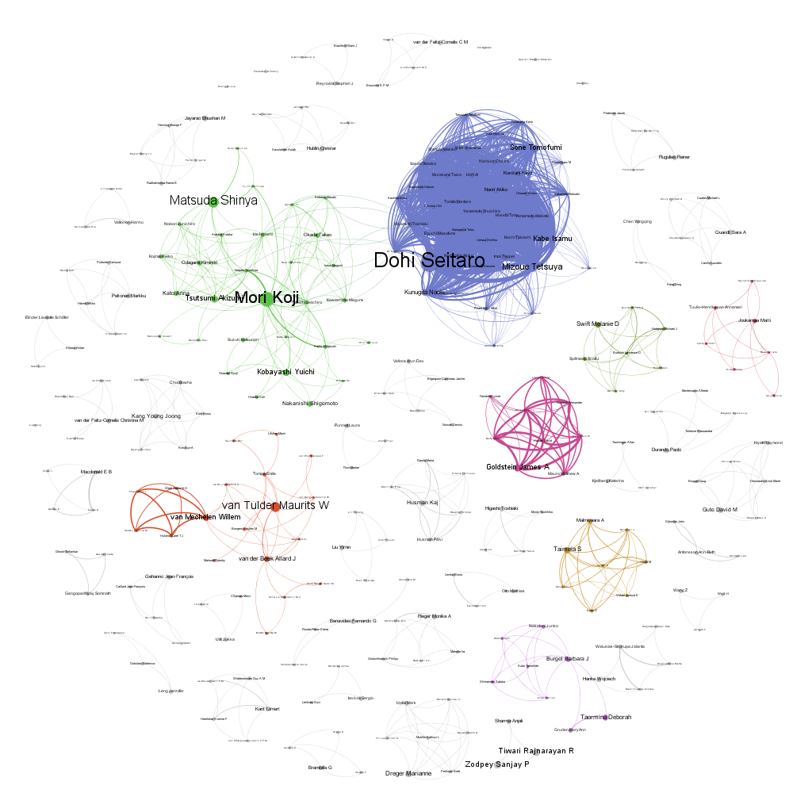

# Example - Author co-occurrence analysis
This example retrieves articles from PubMed and uses the author information to construct a nodes and edges list that can be used for an author co-occurrence analysis (e.g. with a tool like Gephi). A nodes list is created by taking every unique author found in the result set, and the edges list is created by creating a list of all unique combinations of authors. The combinations of authors is also counted so that there is a "weight" column available that indicates the number of times these authors co-occurred. The CSV files produced by this script can be loaded directly into Gephi for further processing.

## Why?
Analyzing all the literature in a field can be a very complicated task. First steps could be to visualize the entire field in a graph. One of these visualizations is the author co-occurrence graph, that shows how authors are inter-connected. The graph helps to answer questions like: What authors connect multiple research groups together?

## Example - Field of occupational health
Here a visualization of the field of occupational health:

